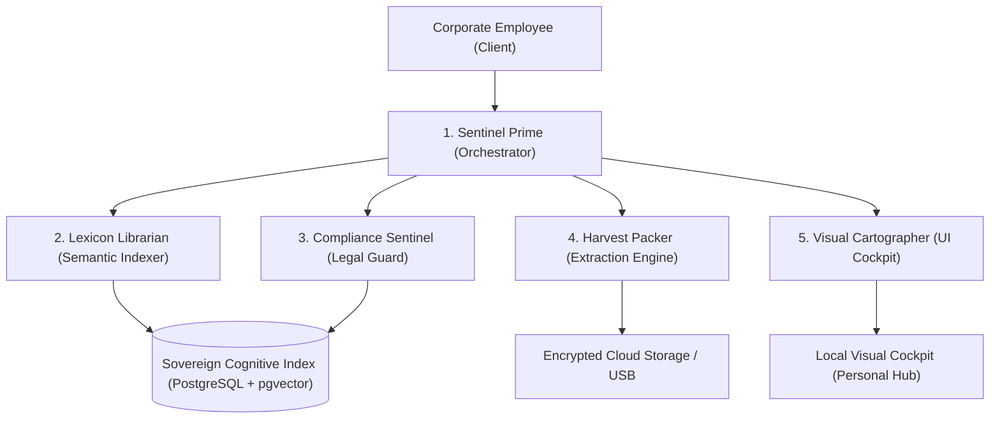

# 🤖 Sentinel: The Sovereign Multi-Agent Exocortex & Guardian Swarm

This document outlines the conceptual and technical architecture for **Sentinel**—a multi-agent exocortex and defensive cognitive hub designed for corporate employees. When preparing to exit a company, employees face a high-risk environment: massive local drives, unstructured personal thoughts, scattered credentials, strict cloud DLP systems, and the legal burden of proving compliance (e.g., Article 20 clean-hands attestation).

Sentinel acts as a professional guardian swarm, systematically auditing, isolating, verifying, and wiping devices, while visually rendering your entire digital identity in a cohesive Personal Hub.

---

## 🧬 1. The Multi-Agent Swarm Architecture

Sentinel utilizes a specialized, stateful multi-agent swarm coordinated via a central orchestrator. Each agent has specific tools, boundaries, and mandates.



### 1️⃣ Sentinel Prime (`sentinel_prime`) — The Swarm Orchestrator
*   **Mandate**: Manages the global offboarding state machine, orchestrates sub-agents, handles user approvals, and maintains the Master Action Plan.
*   **Boundary**: Never executes raw file system writes or network transfers without explicit, single-token user verification.
*   **Cognitive Loop**: Coordinates the transition phases (Audit → Extract → Verify → Wipe) and acts as the direct user-facing sentinel.

### 2️⃣ The Lexicon Librarian (`lexicon_librarian`) — Semantic Indexer
*   **Mandate**: Scans local directory trees (`C:\Users\username\`), hashes all files, extracts metadata, and maps out the complete files directory.
*   **Boundary**: Read-only access to files. Does not read contents of files flagged as company-confidential.
*   **Intelligence Layer**: Uses a local, fast embedding model to classify files into five distinct buckets:
    1.  *Personal IP*: Independent creative work, manuscripts, side-project repositories.
    2.  *Personal Media*: Private photos, videos, and custom music.
    3.  *Personal Legal*: Employment contracts, severance offers, tax filings.
    4.  *Ambiguous Dotfiles*: LLM-configs, terminal settings, cache profiles (regeneratable).
    5.  *Company Property*: Client deliverables, customer databases, source code, internal strategies.

### 3️⃣ The Compliance Sentinel (`compliance_sentinel`) — Legal Defensibility
*   **Mandate**: Enforces strict legal boundaries (e.g., Dutch Employment Law, GDPR, severance confidentiality). Reviews files flagged for extraction.
*   **Boundary**: Prohibits any file containing customer PII, corporate codenames, or company-confidential markers from entering personal archives.
*   **Defensibility Engine**: Generates the **Proactive Compliance Audit** (`COMPLIANCE_AUDIT.md`) and the **Decision Log**, creating an unassailable legal shield of "good faith and compliance" in case of corporate dispute.

### 4️⃣ The Harvest Packer (`harvest_packer`) — Extraction & Optimization
*   **Mandate**: Packages personal assets into compressed, AES-256 encrypted archives.
*   **Boundary**: Operates inside a sandboxed temp partition before moving files to personal storage.
*   **Optimization Engine**: Actively eliminates duplicates and skips redundant system footprints. (For example, identifying and excluding **25.2 GB of standard APK installers** while securing **100% of raw user data**).

### 5️⃣ The Visual Cartographer (`cartography_agent`) — Unified UI Renderer
*   **Mandate**: Synthesizes the swarm's metadata and outputs a single, visually stunning, local-first cockpit (such as `SENTINEL_COCKPIT.html`) and Personal Hub.
*   **Design Grammar**: Implements the **Stellar Cartography** philosophy—using a disciplined cobalt-violet palette, high contrast letterforms, and clinical interactive tables to present data clearly and expensively.

---

## 💾 2. The Personal Hub & Cognitive Dashboard

To prevent drowning in a chaotic sea of disconnected HTMLs, markdown notes, and media folders, Sentinel implements the **Sovereign Cognitive Index (SCI)**:

### 📁 Unified File Architecture
```
C:\Users\username\OneDrive\Backups\2026-05-oracle-transition\
├── S21_Extracted_Personal\            # Extracted mobile raw data
│   ├── Photos/                        # 1,138 verified photos
│   ├── Videos/                        # 196 verified videos
│   └── SamsungNotes/                  # Exocortex lore databases
├── _TAKE_THIS_FOLDER_2026-05-25\      # Laptop personal IP archives
│   ├── browser-bookmarks/             # 5 curated browser profiles
│   ├── severance-documents/           # Signed settlement agreements
│   └── S21_EXTRACTION_REPORT.md       # Mobile validation report
├── SENTINEL_COCKPIT.html              # Centralized visual interface
└── SENTINEL_SWARM_ARCHITECTURE.md    # This master blueprint
```

### 🖥️ Local-First Unified Cockpit
Rather than separate files, the `SENTINEL_COCKPIT.html` acts as a unified hub:
*   **Unified State**: Stored in a single local browser SQLite file (via `sql.js` or `IndexedDB`) so it functions completely offline.
*   **Deep Navigation**: Lets you click and drill down into folder structures, read markdown journals, search bookmarked sites, and verify severance calculation runway charts on the fly.
*   **Interactive Attestation**: Enables checking off manual steps, tracking API key rotation, and viewing active OneDrive cloud sync speeds.

---

## 🛡️ 3. The 100% Verification Protocol (Peace of Mind Engine)

To cure the common offboarding anxiety—*"Did we miss something? Is there a photo, a password, or a writing note left on the machine?"*—Sentinel deploys a mathematical verification protocol:

```
[Local File System] ──► [Librarian Hash Scan] ──► [Compare to Cloud Index] ──► [Match Attestation] ──► [Safe Wipe]
```

### 🔍 A. Recursive Checksum Audit
1.  **Index Scan**: `lexicon_librarian` hashes every single file in the user profile (`MD5`/`SHA-256`) and records it in a `MASTER_HASH_REGISTER.csv`.
2.  **Archive Scan**: The `harvest_packer` generates hashes of files inside the encrypted tarballs.
3.  **Cross-Check**: Sentinel compares the two registers to prove with **100% mathematical certainty** that every file marked as "Personal" is successfully archived inside a tarball.

### 🧠 B. Semantic Missingness Analysis (Anomaly Detection)
Sentinel looks for "stealth directories" that standard folder scans miss:
*   **AppData Scans**: Analyzes local AppData configs. If a folder like `C:\Users\username\AppData\Local\WisprFlow` contains large voice records, it overrides standard system filters and flags it.
*   **Document Scans**: Analyzes folder names. If a folder contains no git structure but has file patterns matching personal creative writing, it is flagged as "High-Value Thoughts" and pulled into the transition package.

### 🌐 C. Cloud-Side Attestation
Before you run the destructive `HANDBACK_CLEANUP.ps1` script to wipe your laptop:
1.  Sentinel calls the OneDrive Cloud API to request the directory manifest of `Backups/2026-05-oracle-transition/` in the cloud.
2.  It matches the **cloud-side checksums** against your **local-side transition folder**.
3.  Only when there is a **100% match** does Sentinel issue a green-light attestation:
    `[SENTINEL ATTESTATION]: CLOUD SYNC 100% MATCH. LOCAL WIPE AUTHORIZED.`

---

## 🌍 4. Blueprint for the Corporate Employee

This multi-agent paradigm can be packaged as a template-first framework:

1.  **Sovereign Node Setup**: A single local setup file that boots up the LangGraph Swarm on the employee's machine (running locally using private, offline models to prevent prompt leaks).
2.  **Smart Harvest**: Automatically runs the compliant scans, filtering out company property to protect the employee from legal retaliation.
3.  **Cognitive Landing**: Renders the premium static Cockpit on their personal drive, allowing them to manage their entire career transition, job search runway, outplacement trackers, and portfolio in one expensive, highly-polished exocortex.

_This is the architecture of digital sovereignty—ensuring that when an employee leaves an enterprise, they leave legally safe, fully verified, and in absolute possession of their own mind._
